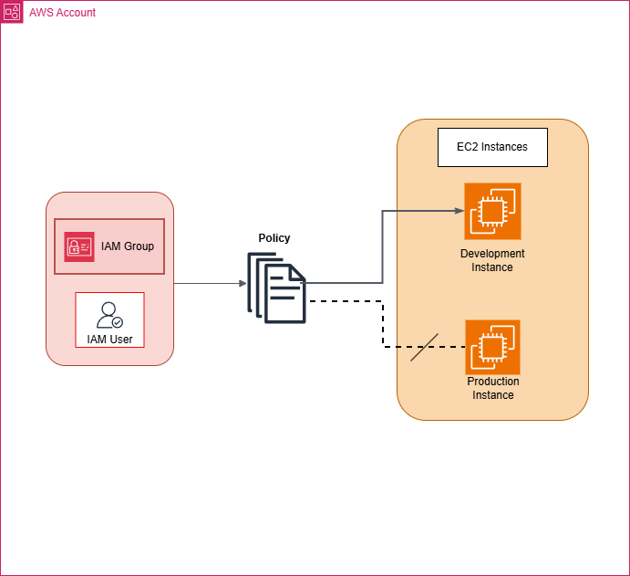

# Cloud Security with AWS IAM

## Overview
This project demonstrates a secure AWS network architecture.

## Services Used
- AWS IAM
- Amazon EC2
- IAM Groups
- IAM Users
- IAM Policies

## Architecture

## Steps

1. Launch EC2 Instances
To demonstrate tag-based access control in AWS, I created two EC2 instances.  
The first instance, cloudlab-prod-web, represents the production environment and was tagged with the key-value pair environment=production.  
The second instance, cloudlab-dev-web, represents the development environment and was tagged with the key-value pair environment=development.

2. Create the IAM policies
Next, I created a custom IAM policy named CloudLab-EC2DevAccess-Policy.  
This policy grants users permission to manage EC2 instances only when the resource tag environment has a value of development.  
The policy uses the condition aws/environment = development to enforce this restriction.

3. Create the IAM user groups
After creating the policy, I created an IAM group named Developers.  
The CloudLab-EC2DevAccess-Policy was attached to this group so that any user added to the Developers group automatically receives permissions to manage development EC2 instances.

4. Create the IAM users and assign them to the groups
I then created an IAM user named pierre.konan and added the user to the appropriate IAM groups.  
The user signed in using the AWS account alias and IAM username, then created a new password as part of the initial login process.

5. Test the access permissions
To verify the configuration, the user attempted to stop both EC2 instances.  
The action was successful on the cloudlab-dev-web instance because it matched the required tag condition.  

However, the attempt to stop the cloudlab-prod-web instance failed because the production instance did not satisfy the policy condition, confirming that access was correctly restricted to development resources only.

## Lessons Learned
- The importance of least privilege access
- How to use IAM policies effectively
- Best practices for securing AWS resources

## Conclusion
By implementing a secure AWS network architecture using IAM, we can protect our resources and ensure that only authorized users have access to them.  
This project serves as a practical example of how to apply security best practices in the cloud.